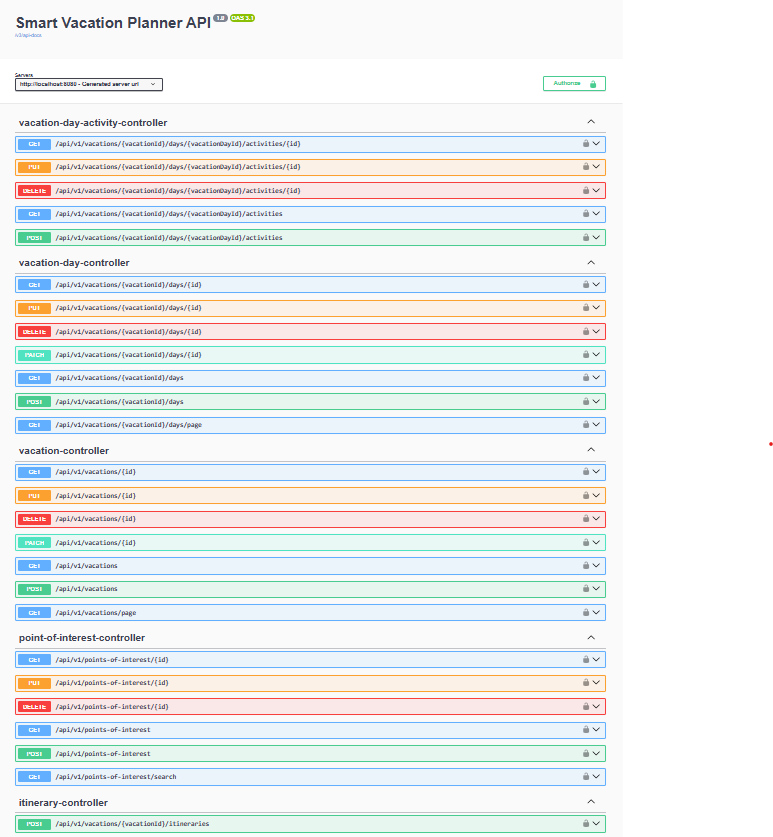
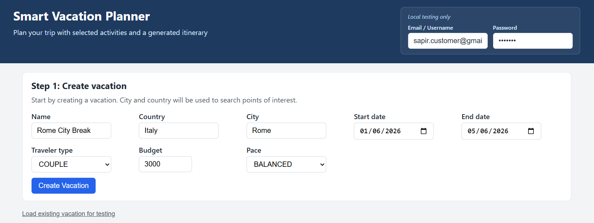
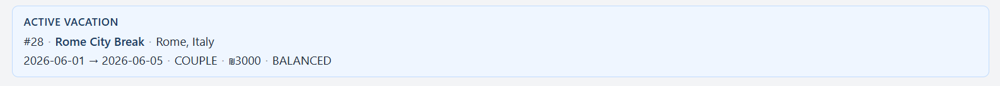
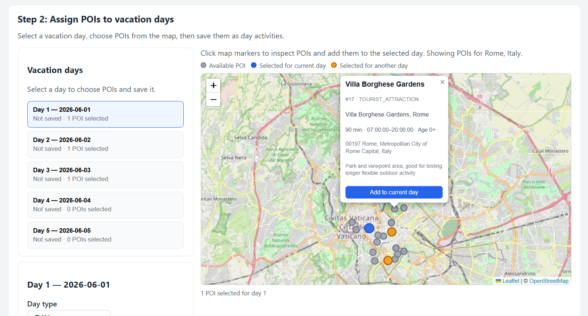
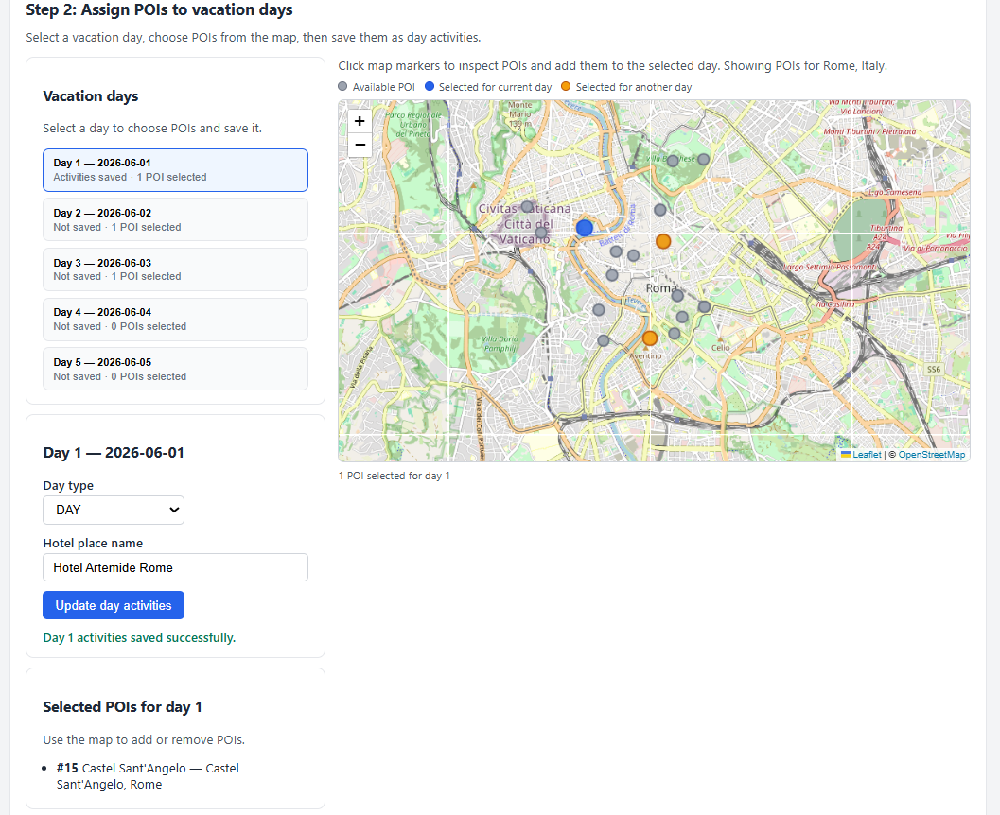
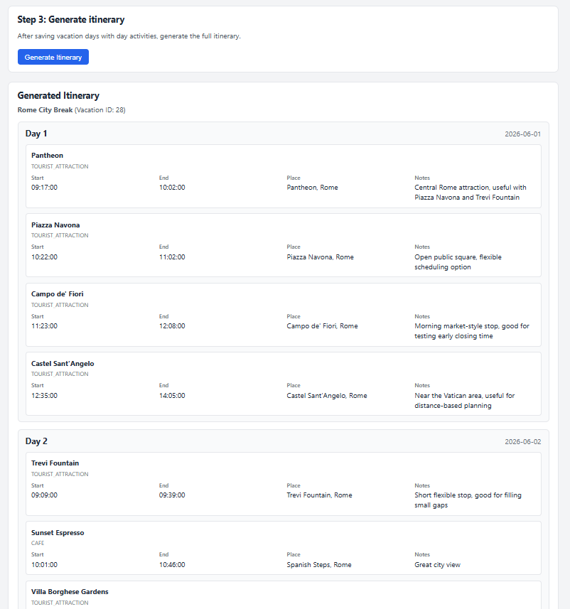

# Smart Vacation Planner

Smart Vacation Planner is a backend-focused vacation planning system built with Java and Spring Boot.

The system allows users to create vacations, enrich destination data with Google Places, select points of interest, assign them to vacation days, and generate a scheduled itinerary based on deterministic backend rules such as opening hours, activity duration, distance, and estimated travel time.

This project is built as a backend portfolio project, with a focus on clean architecture, REST API design, persistence, validation, security, ownership checks, external API integration, and incremental delivery.

---

## Project Status

This project is currently under active development.

Implemented or mostly implemented:

* Vacation CRUD
* Vacation day CRUD
* Points of interest catalog
* Google Places enrichment
* Selected points of interest per vacation day
* Deterministic itinerary generation
* Spring Security with Basic Auth
* DB-backed users and roles
* Ownership checks in the service layer
* Global exception handling
* Filtering and pagination for key resources
* Swagger/OpenAPI configuration

Still in progress:

* Final API cleanup for selected day activities
* End-to-end manual QA flow
* Automated tests
* Frontend alignment
* README/run instructions refinement
* More advanced itinerary rules
* Future AI-assisted planning

---

## Table of Contents

* [Why I Built This](#why-i-built-this)
* [Core Features](#core-features)
* [Product Flow](#product-flow)
* [Domain Model](#domain-model)
* [Architecture](#architecture)
* [Tech Stack](#tech-stack)
* [API Overview](#api-overview)
* [Itinerary Generation Logic](#itinerary-generation-logic)
* [Security](#security)
* [Error Handling](#error-handling)
* [Google Places Integration](#google-places-integration)
* [Screenshots](#screenshots)
* [Getting Started](#getting-started)
* [Configuration](#configuration)
* [Running the Application](#running-the-application)
* [Swagger / API Documentation](#swagger--api-documentation)
* [Manual Demo Flow](#manual-demo-flow)
* [Testing Plan](#testing-plan)
* [Roadmap](#roadmap)
* [Interview Highlights](#interview-highlights)

---

## Why I Built This

The main goal of this project is to demonstrate backend engineering skills through a realistic product domain.

Instead of building a simple CRUD-only app, this project includes:

* nested resources
* user ownership
* reusable catalog data
* external API integration
* business validation
* scheduling logic
* security rules
* structured error responses
* future-ready architecture for AI-assisted planning

The project intentionally starts with a deterministic backend foundation before adding AI features. This makes the system easier to test, reason about, and explain in interviews.

---

## Core Features

### Vacation management

Users can create and manage vacations with:

* destination country and city
* start and end dates
* traveler type
* budget
* travel pace

### Vacation day management

Each vacation can contain multiple days.

Each day includes:

* date
* day number
* day type
* hotel location enriched through Google Places

### Points of interest catalog

The system supports a reusable catalog of points of interest.

A point of interest includes:

* name
* category
* place name
* Google place ID
* formatted address
* city and country
* latitude and longitude
* duration
* opening and closing time
* minimum age
* notes

### Selected day activities

Users can assign selected points of interest to specific vacation days.

This is represented by `VacationDayActivity`, which connects:

* a vacation day
* a point of interest
* scheduling fields generated later by the itinerary algorithm

### Itinerary generation

The backend generates a daily itinerary from selected points of interest.

The current algorithm:

* starts from the hotel
* estimates travel time
* checks opening hours
* checks if an activity fits before the end of the day
* chooses the nearest schedulable activity
* saves planned times and travel metadata
* returns a structured itinerary response

---

## Product Flow

1. User creates or loads a vacation.
2. User searches or manages points of interest for the vacation destination.
3. User selects relevant points of interest from the destination catalog.
4. User creates vacation days and assigns selected points of interest to each day.
5. System generates a scheduled itinerary for each day based on the assigned points of interest.
6. User views the generated daily plan.

---

## Domain Model

### User

Represents an authenticated user.

Main fields:

* `id`
* `firstName`
* `lastName`
* `email`
* `password`
* `role`
* `active`

Roles:

* `CUSTOMER`
* `ADMIN`

Rules:

* A customer can access only their own vacations.
* An admin can access broader system data.

---

### Vacation

Represents a vacation or trip container.

Main fields:

* `id`
* `user`
* `name`
* `country`
* `city`
* `startDate`
* `endDate`
* `travelerType`
* `budget`
* `pace`

Business rules:

* `endDate` must be on or after `startDate`.
* A vacation belongs to a user.
* Ownership is enforced in the service layer.

---

### VacationDay

Represents one day inside a vacation.

Main fields:

* `id`
* `vacation`
* `date`
* `dayNumber`
* `dayType`
* `hotelPlace`

Business rules:

* The day must belong to an existing vacation.
* The date must be within the parent vacation date range.
* The day number must be positive.
* The day number must not exceed the vacation duration.

---

### Place

Embedded location object used by both vacation days and points of interest.

Fields:

* `placeName`
* `placeId`
* `formattedAddress`
* `city`
* `country`
* `latitude`
* `longitude`

---

### PointOfInterest

Represents a reusable destination catalog item.

Main fields:

* `id`
* `name`
* `pointOfInterestCategory`
* `place`
* `durationMinutes`
* `openingTime`
* `closingTime`
* `minimumAge`
* `notes`

Categories:

* `TOURIST_ATTRACTION`
* `MUSEUM`
* `VIEWPOINT`
* `RESTAURANT`
* `CAFE`
* `HIKE`
* `SHOPPING`
* `TRANSPORT`
* `OTHER`

---

### VacationDayActivity

Represents a selected point of interest assigned to a specific vacation day.

Main fields:

* `id`
* `vacationDay`
* `pointOfInterest`
* `plannedStartTime`
* `plannedEndTime`
* `travelMinutesFromPrevious`
* `distanceKmFromPrevious`

Important distinction:

* `PointOfInterest` is the reusable catalog item.
* `VacationDayActivity` is the user-specific selection for a vacation day.
* `ScheduledActivityResponse` is the generated itinerary output.

---

## Architecture

The project uses a layered backend architecture.

```text
src/main/java/com/sapir/smartvacationplanner
│
├── common
│   └── place
│
├── config
│
├── controller
│
├── dto
│   ├── error
│   ├── itinerary
│   ├── PointOfInterest
│   ├── vacation
│   ├── vacationDay
│   └── VacationDayActivity
│
├── entity
│   └── enums
│
├── exception
│
├── integration
│   └── google
│
├── repository
│
├── security
│
└── service
    └── itinerary
```

### Layer responsibilities

| Layer             | Responsibility                               |
| ----------------- | -------------------------------------------- |
| Controller        | Exposes REST endpoints and maps responses    |
| DTO               | Defines API request/response contracts       |
| Entity            | JPA/Hibernate persistence model              |
| Repository        | Spring Data JPA data access                  |
| Service           | Business logic, validation, ownership checks |
| Integration       | External API communication                   |
| Security          | Authentication, authorization, CORS          |
| Exception         | Global error handling                        |
| Itinerary service | Scheduling algorithm                         |

---

## Tech Stack

### Backend

* Java
* Spring Boot
* Spring Web
* Spring Security
* Spring Data JPA
* Hibernate
* MySQL
* Maven

### External API

* Google Places Text Search

### API documentation

* Swagger / OpenAPI via springdoc-openapi

### Frontend

A React + Vite frontend is planned/partially implemented and will be aligned with the current backend API flow.

---

## API Overview

### Vacations

```http
GET    /api/v1/vacations
GET    /api/v1/vacations/page
GET    /api/v1/vacations/{id}
POST   /api/v1/vacations
PUT    /api/v1/vacations/{id}
PATCH  /api/v1/vacations/{id}
DELETE /api/v1/vacations/{id}
```

Example create request:

```json
{
  "name": "Romantic Rome Escape",
  "country": "Italy",
  "city": "Rome",
  "startDate": "2026-09-01",
  "endDate": "2026-09-04",
  "travelerType": "COUPLE",
  "budget": 2500,
  "pace": "BALANCED"
}
```

---

### Vacation Days

```http
GET    /api/v1/vacations/{vacationId}/days
GET    /api/v1/vacations/{vacationId}/days/page
GET    /api/v1/vacations/{vacationId}/days/{id}
POST   /api/v1/vacations/{vacationId}/days
PUT    /api/v1/vacations/{vacationId}/days/{id}
PATCH  /api/v1/vacations/{vacationId}/days/{id}
DELETE /api/v1/vacations/{vacationId}/days/{id}
```

Example create request:

```json
{
  "date": "2026-09-01",
  "dayNumber": 1,
  "dayType": "DAY",
  "hotelPlaceName": "Hotel Artemide, Rome"
}
```

---

### Points of Interest

```http
GET    /api/v1/points-of-interest
GET    /api/v1/points-of-interest/search
GET    /api/v1/points-of-interest/{id}
POST   /api/v1/points-of-interest
PUT    /api/v1/points-of-interest/{id}
DELETE /api/v1/points-of-interest/{id}
```

Example create request:

```json
{
  "name": "Colosseum",
  "pointOfInterestCategory": "TOURIST_ATTRACTION",
  "placeName": "Colosseum, Rome",
  "durationMinutes": 120,
  "openingTime": "09:00:00",
  "closingTime": "17:00:00",
  "minimumAge": 0,
  "notes": "Iconic ancient amphitheatre and one of Rome's main landmarks."
}
```

Example search:

```http
GET /api/v1/points-of-interest/search?city=Rome&country=Italy&page=0&size=5
```

---

### Vacation Day Activities

Target endpoint shape:

```http
GET    /api/v1/vacations/{vacationId}/days/{vacationDayId}/activities
GET    /api/v1/vacations/{vacationId}/days/{vacationDayId}/activities/{id}
POST   /api/v1/vacations/{vacationId}/days/{vacationDayId}/activities
PUT    /api/v1/vacations/{vacationId}/days/{vacationDayId}/activities/{id}
DELETE /api/v1/vacations/{vacationId}/days/{vacationDayId}/activities/{id}
```

Example create request:

```json
{
  "pointOfInterestId": 12
}
```

This creates a selected activity for a specific vacation day, based on an existing point of interest.

---

### Itinerary

```http
POST /api/v1/vacations/{vacationId}/itineraries
```

Example response shape:

```json
{
  "vacationId": 1,
  "vacationName": "Romantic Rome Escape",
  "days": [
    {
      "vacationDayId": 1,
      "dayNumber": 1,
      "date": "2026-09-01",
      "activities": [
        {
          "vacationDayActivityId": 10,
          "pointOfInterestName": "Colosseum",
          "pointOfInterestCategory": "TOURIST_ATTRACTION",
          "plannedStartTime": "09:20:00",
          "plannedEndTime": "11:20:00",
          "placeName": "Colosseum, Rome",
          "notes": "Iconic ancient amphitheatre and one of Rome's main landmarks."
        }
      ]
    }
  ]
}
```

---

## Itinerary Generation Logic

The current itinerary generator is deterministic and rule-based.

For each vacation day:

1. Start from the hotel location.
2. Start the day at 09:00.
3. End the day at 18:00.
4. Load selected vacation day activities.
5. For each unscheduled activity:

   * calculate distance from the current place
   * estimate travel time
   * calculate possible start and end time
   * check opening and closing time
   * check if the activity fits before the day ends
6. Choose the nearest schedulable activity.
7. Save:

   * planned start time
   * planned end time
   * travel minutes from previous
   * distance from previous
8. Continue until no more activities fit or the day ends.

Current tradeoff:

* The algorithm is simple and explainable.
* It is not yet globally optimal.
* It is intentionally deterministic before introducing AI or advanced route optimization.

---

## Security

The current security model uses:

* Spring Security
* Basic Auth
* DB-backed users
* login by email
* role-based endpoint authorization
* ownership checks in the service layer
* CORS for local frontend development
* CSRF disabled for REST API usage

### Roles

* `CUSTOMER`
* `ADMIN`

### Ownership model

A customer can only access and manage their own vacations.

Nested resources such as vacation days and selected activities are accessed through the parent vacation context, so ownership is enforced through the vacation hierarchy.

---

## Error Handling

The API uses a global exception handler and returns a consistent error shape.

Example validation error:

```json
{
  "message": "Validation failed",
  "path": "/api/v1/vacations",
  "status": 400,
  "timestamp": "2026-06-22T12:00:00Z",
  "fieldErrors": [
    {
      "field": "name",
      "error": "Name is required"
    }
  ]
}
```

Handled cases include:

* validation errors
* resource not found
* business rule violations
* access denied
* unexpected server errors

---

## Google Places Integration

The system integrates with Google Places Text Search to enrich location data.

Used for:

* point of interest locations
* vacation day hotel locations

Stored fields:

* Google place ID
* formatted address
* city
* country
* latitude
* longitude

This allows the itinerary generator to work with real geographic coordinates.

---

## Screenshots

The screenshots below show the main API structure and the frontend planning flow.

### 1. Swagger API overview

The backend exposes a REST API documented with Swagger/OpenAPI, including endpoints for vacations, vacation days, points of interest, selected day activities, and itinerary generation.



### 2. Vacation setup

The user can create a new vacation or load an existing one. Once a vacation is selected, the next steps in the planning flow become available.



### 3. Vacation overview

The selected vacation displays its destination, dates, and planned days, providing the context for choosing points of interest.



### 4. Point of interest selection

The user can browse available points of interest for the selected destination and choose which ones to assign to specific vacation days.



### 5. Saved day activities

Selected points of interest are saved as day activities, connecting reusable POIs from the catalog to specific days in the vacation.



### 6. Generated itinerary

After selecting points of interest, the backend generates a daily itinerary with planned start and end times.



---

## Getting Started

### Prerequisites

Make sure you have installed:

* Java 17 or later
* Maven
* MySQL
* Google Places API key
* Optional: Node.js and npm if running the frontend

---

## Configuration

Create or update your local application properties.

Example:

```properties

spring.application.name=smartvacationplanner
spring.datasource.url=jdbc:mysql://localhost:3306/smart_vacation_planner

spring.datasource.username=${DB_USERNAME}
spring.datasource.password=${DB_PASSWORD}

google.maps.api-key=REMOVED_GOOGLE_MAPS_API_KEY
google.maps.api-key=${GOOGLE_MAPS_API_KEY}

server.port=8080

spring.jpa.hibernate.ddl-auto=update
spring.jpa.show-sql=true
```

Do not commit real secrets or API keys.

Recommended future improvement:

* move secrets to environment variables
* add `application-example.properties`
* keep real local config ignored by Git

---

## Running the Application

From the backend project root:

```bash
mvn spring-boot:run
```

Or on Windows PowerShell:

```powershell
mvn spring-boot:run
```

The backend should start on:

```text
http://localhost:8080
```

---

## Swagger / API Documentation

Swagger UI is available at:

http://localhost:8080/swagger-ui.html

This may redirect to `/swagger-ui/index.html` depending on the Springdoc version.

The OpenAPI JSON is available at:

http://localhost:8080/v3/api-docs

---

## Manual Demo Flow

Use this flow to verify the backend manually.

### 1. Create or verify a user

Create a user directly in the database for now.

Example role values:

```text
CUSTOMER
ADMIN
```

Use this user for Basic Auth when calling protected endpoints.

### 2. Create a vacation

```http
POST /api/v1/vacations
```

Save the returned vacation `id`.

### 3. Create or search points of interest

Create points of interest for the vacation destination if they do not already exist:

```http
POST /api/v1/points-of-interest
```

Search points of interest by destination:

```http
GET /api/v1/points-of-interest/search?city=Rome&country=Italy
```

Save the relevant point of interest IDs.

### 4. Create vacation days

```http
POST /api/v1/vacations/{vacationId}/days
```

Save the returned vacation day IDs.

### 5. Assign selected points of interest to days

```http
POST /api/v1/vacations/{vacationId}/days/{vacationDayId}/activities
```

Body:

```json
{
  "pointOfInterestId": 12
}
```

Repeat this step for each selected point of interest that should be part of that day.

### 6. Generate itinerary

```http
POST /api/v1/vacations/{vacationId}/itineraries
```

### 7. Verify itinerary output

Check that the generated itinerary includes scheduled activities with:

* point of interest name
* planned start time
* planned end time
* place name
* notes

### 8. Verify database updates

Check that selected day activities now include:

* planned start time
* planned end time
* travel minutes from previous
* distance from previous

### 9. Verify security

Check that:

* a customer cannot access another customer's vacation
* an admin can access broader data where allowed
* unauthenticated requests are rejected
* forbidden requests return 403

---

## Testing Plan

Automated tests are planned as the next backend quality step.

### Recommended unit tests

#### VacationService

* rejects vacation where end date is before start date
* assigns current user when creating vacation
* returns only current user's vacations for customer
* returns all vacations for admin

#### VacationDayService

* rejects day before vacation start date
* rejects day after vacation end date
* rejects day number greater than vacation duration
* enriches hotel place through Google Places client

#### AuthorizationService

* allows owner access
* allows admin access
* rejects non-owner access

#### ItineraryService

* schedules an activity inside opening hours
* skips activity that cannot fit
* chooses nearest schedulable candidate
* saves planned time and travel metadata

### Recommended integration tests

* create vacation and fetch it
* create vacation day under vacation
* create point of interest with Google client mocked
* assign POI to vacation day
* generate itinerary
* verify ownership restrictions

---

## Roadmap

### Near-term

* Finalize selected activities endpoint naming.
* Add request DTO for creating/updating selected activities.
* Verify delete behavior for vacations, days, and selected activities.
* Add automated tests for core services.
* Update README with screenshots.
* Align frontend with backend API.

### Mid-term

* Improve itinerary generation rules.
* Add support for vacation pace.
* Add support for day type.
* Add lunch/dinner breaks.
* Add configurable day start and end times.
* Improve sorting and filtering.

### Later

* Add AI-assisted planning.
* Add AI preference collection.
* Add AI-generated recommendations.
* Validate AI output against backend rules.
* Keep deterministic backend logic as the source of truth.

---

## Future AI Direction

AI will be added only after the deterministic backend is stable.

Possible AI capabilities:

* collect user preferences through chat
* recommend points of interest
* explain itinerary tradeoffs
* generate draft plans
* convert natural language into structured requests

Important guardrails:

* AI output must be validated.
* AI should not bypass backend rules.
* AI should not directly write invalid data.
* Deterministic backend constraints should remain the source of truth.

---

## Interview Highlights

This project demonstrates:

* Java and Spring Boot backend development
* REST API design
* nested resources
* DTO-based API contracts
* validation and business rules
* JPA/Hibernate persistence
* MySQL data modeling
* Spring Security
* role-based authorization
* user ownership checks
* global exception handling
* external API integration
* deterministic scheduling logic
* incremental product thinking
* preparation for future AI integration

### Short interview explanation

I built a Smart Vacation Planner backend in Java Spring Boot. The system lets users create vacations, enrich destination data through Google Places, select points of interest, assign them to vacation days, and generate a scheduled itinerary based on opening hours, duration, distance, and estimated travel time.

The project demonstrates layered architecture, REST API design, DTO validation, JPA/Hibernate persistence, Spring Security with DB-backed users, ownership checks, external API integration, global error handling, and deterministic backend logic that can later support AI-assisted planning.

---

## Known Limitations

* The itinerary algorithm is greedy and not globally optimal.
* Travel time is estimated, not based on a real Directions API.
* Tests are not fully implemented yet.
* Frontend flow still needs alignment with the current backend.
* Authentication currently uses Basic Auth for learning/demo purposes.
* Production-ready secret management is still planned.

---

## Author

Built by Sapir Ariel as part of a backend-focused transition project and interview preparation portfolio.
